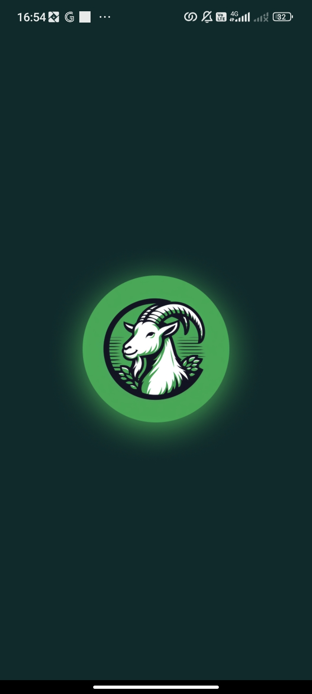
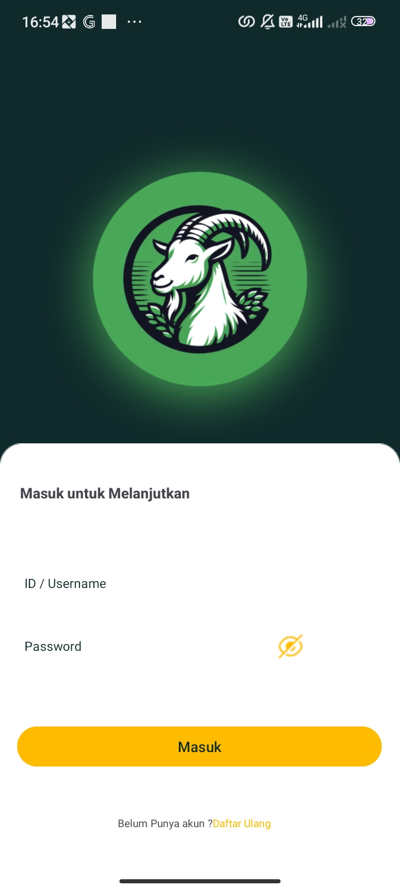
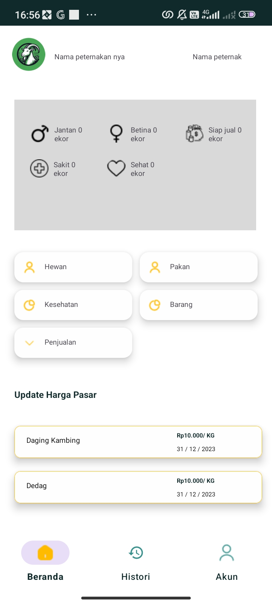
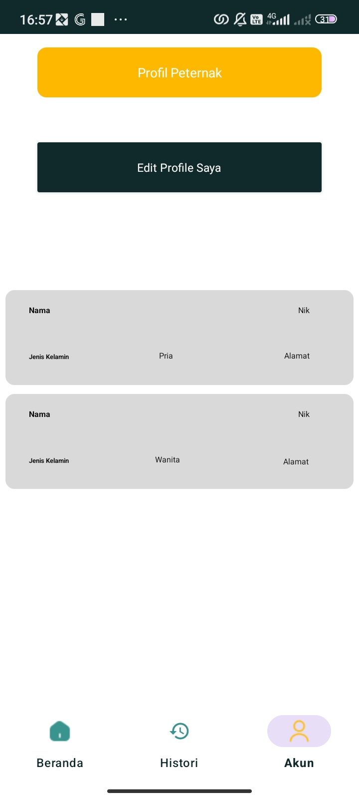
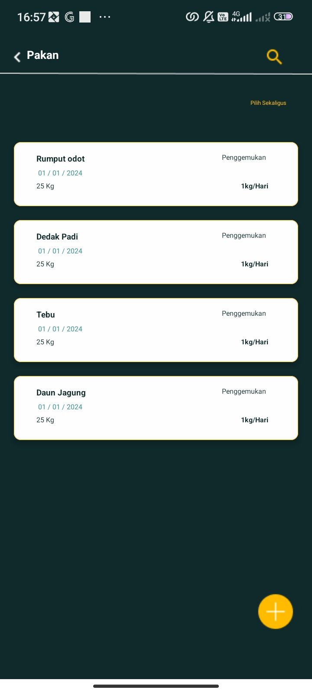
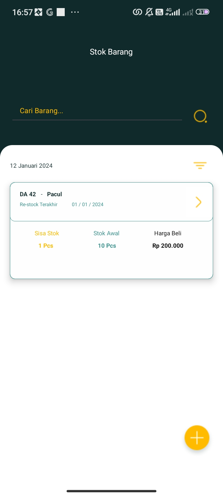
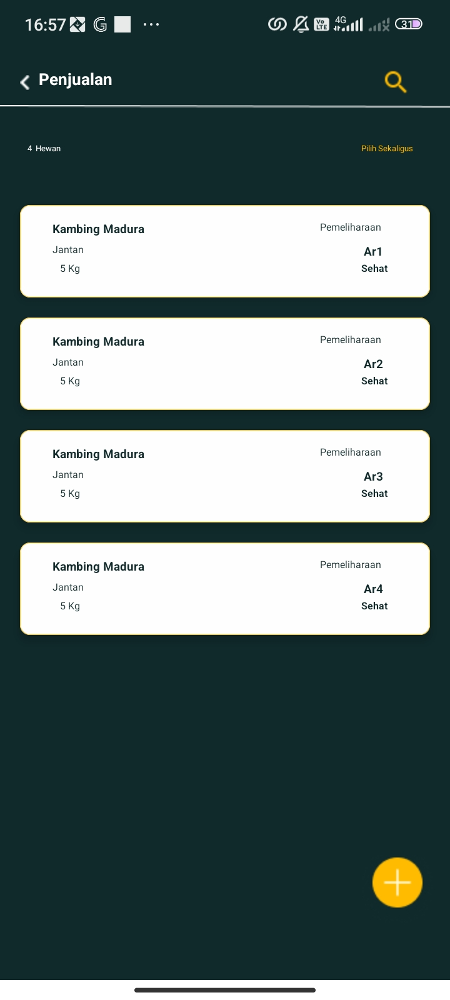
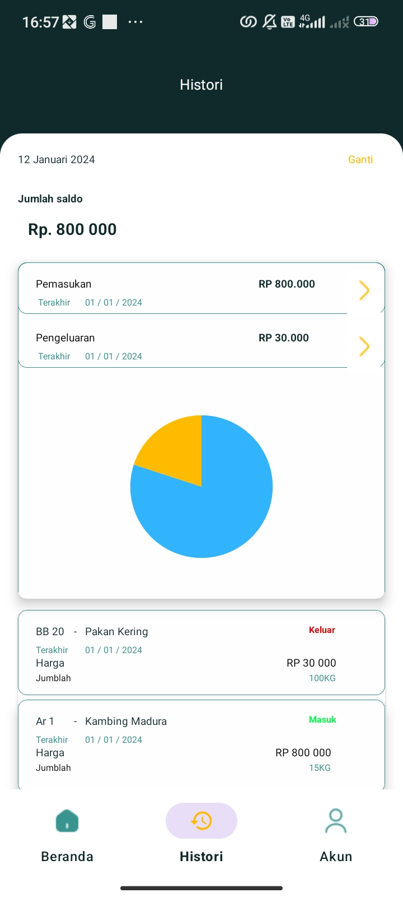
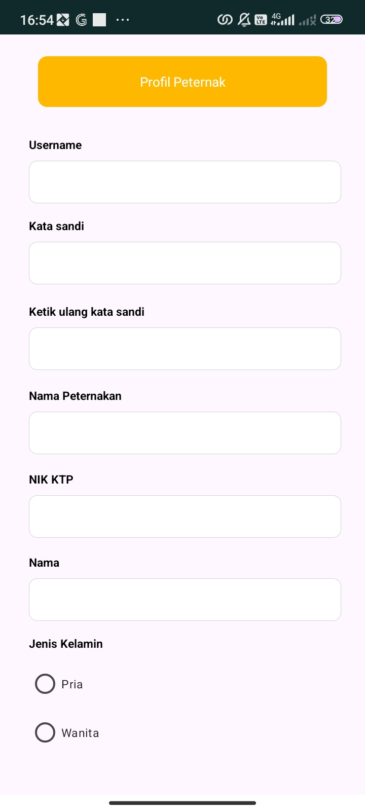

# 🐄 Peternakan App UI

**Peternakan App** adalah aplikasi mobile untuk membantu pengelolaan usaha peternakan secara digital.  
Aplikasi ini memudahkan pencatatan data hewan, stok pakan, penjualan, serta riwayat transaksi dalam satu sistem yang sederhana dan mudah digunakan.

---

## 🖼️ Tampilan Aplikasi

### Splash Screen & Login
<table align="center">
  <tr>
    <td align="center">
       
      <b>Splash Screen</b>
    </td>
    <td align="center">
       
      <b>Login</b>
    </td>
  </tr>
</table>

---

### Beranda & Akun
<table align="center">
  <tr>
    <td align="center">
       
      <b>Beranda</b>
    </td>
    <td align="center">
       
      <b>Akun</b>
    </td>
  </tr>
</table>

---

### Data Peternakan
<table align="center">
  <tr>
    <td align="center">
       
      <b>Daftar Hewan</b>
    </td>
    <td align="center">
       
      <b>Daftar Pakan</b>
    </td>
  </tr>
</table>

---

### Stok & Penjualan
<table align="center">
  <tr>
    <td align="center">
       
      <b>Stok Barang</b>
    </td>
    <td align="center">
       
      <b>Penjualan</b>
    </td>
  </tr>
</table>

---

### Riwayat & Profil
<table align="center">
  <tr>
    <td align="center">
       
      <b>History</b>
    </td>
    <td align="center">
       
      <b>Profil Peternak</b>
    </td>
  </tr>
</table>
